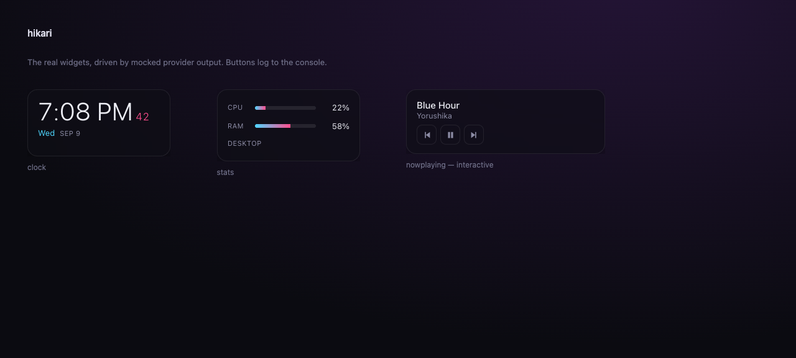
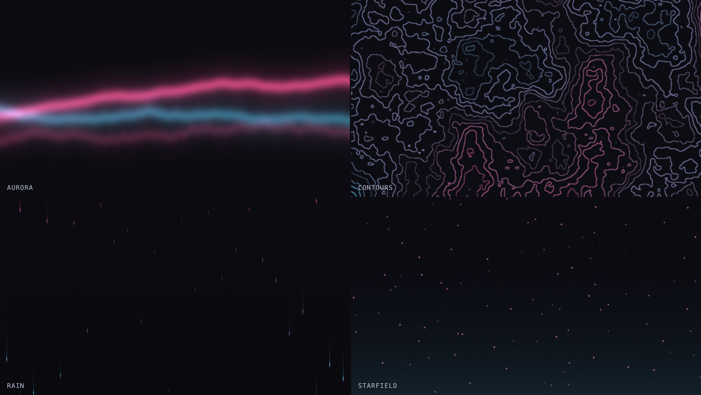
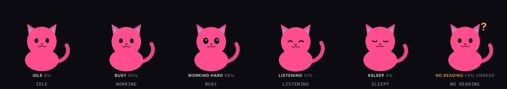

# hikari

Desktop widgets written in HTML, CSS and JavaScript. Transparent, always on top, driven by
live system data. **No window manager required.**



Linux has [AGS](https://aylur.github.io/astal/) and [eww](https://github.com/elkowar/eww),
where a widget is a few lines of code and the whole desktop is themeable. Windows has
Rainmeter, where a widget is INI and Lua. This is the first shape, for any OS.

## A widget is a folder

```
widgets/clock/
  widget.json    where it goes
  index.html     what it is
```

```json
{ "name": "clock", "anchor": "top_right", "width": 230, "height": 108, "margin": 20 }
```

```html
<script>
  hikari.subscribe((state) => {
    document.querySelector("#t").textContent = state.date.time;
  });
</script>
```

That is the whole API. `anchor` is one of `top`/`middle`/`bottom` crossed with
`left`/`center`/`right`, resolved against the **work area**, so a taskbar never covers a
widget. `offsetX` and `offsetY` stack on top, which is how two widgets share an anchor.

Set `"interactive": true` for a widget with buttons. Anything else is click-through, so it
never eats a click meant for the desktop behind it.

## Overlays

Three keys turn a widget into something you summon rather than something that sits there.

```json
{ "name": "decoder", "hotkey": "Alt+Space", "startHidden": true, "interactive": true,
  "clipboard": true, "anchor": "middle_center", "width": 720, "height": 460 }
```

| | |
| --- | --- |
| `hotkey` | a global shortcut that shows and hides this widget |
| `startHidden` | built and loaded at startup, but not on screen until summoned |
| `clipboard` | this widget may read the clipboard. Nothing else may |

`interactive` matters here too: a window built non-focusable cannot be typed into, and
`focus()` on one does nothing.

**A global shortcut that quietly does nothing is the whole failure mode of this feature**,
so every reason one is unbound is printed at startup. There are three, and none of them
announces itself otherwise:

- The accelerator is not one Electron understands. `Ctrl+Shft+K` is a one-character typo, so
  the message names `shft` rather than the whole string.
- Two widgets asked for the same shortcut. First asked wins and the other is told who has
  it, because registering both means one never fires with nothing to say which.
- Another application already owns it. `globalShortcut.register` reports this by returning
  `false`, and ignoring that return is the classic bug here.

A shortcut with no modifier is refused outright. `"hotkey": "K"` would take that key away
from every application on the machine, including the one in front of you.

### Clipboard access is asked for, and refused by default

Until this, the worst a widget could do was skip a track. Reading the clipboard is a
different class of thing: a wallpaper shader that could read a password you had just copied
is not a wallpaper. So it is opt in per widget, and the check happens in the main process
against the manifest of the window the request came from, which is the one place a widget
cannot reach.

```js
// Rejects for a widget whose widget.json did not ask.
const text = await hikari.clipboard.readText();

// The cue that matters: the interaction is copy something, then press the key.
hikari.onShown(() => hikari.clipboard.readText().then(decode));
```

A widget reading the clipboard at load reads it at the wrong moment, which is what
`onShown` is for. And a refusal rejects rather than returning an empty string: an empty
string is indistinguishable from an empty clipboard, so the widget would say "nothing
copied" and the permission would look like a bug in the clipboard.

The preview's `?clipboardText=...` stands in for the clipboard so an overlay can be built
against a known input. It does **not** model the permission, because a browser has no
trusted process to enforce it in, and a second copy of a security rule is worse than none.

## Editing a widget applies it

The host watches both widget roots as well as `~/.hikari`:

- an `index.html`, a stylesheet or a shader changes, and that one window reloads
- a `widget.json` changes, and the host re-discovers, so a widget can be added, removed,
  moved or renamed while it is running

## Media, GIF and video

A widget can be a **GIF, APNG, WebP, MP4 or WebM**, local file or URL. The `media` widget
picks `<video>` or `` by extension, because a `<video>` cannot play a GIF and an ``
cannot loop or rate-control a video.

```json
{
  "name": "media",
  "source": "C:/wallpapers/rain.mp4",
  "fit": "cover",
  "opacity": 0.9,
  "loop": true,
  "muted": true,
  "playbackRate": 0.75,
  "radius": 16
}
```

`muted` defaults to true and that is load-bearing: a browser refuses to autoplay audio, so
an unmuted video silently never starts.

### As a live wallpaper

```json
{ "name": "wallpaper", "fill": "screen", "layer": "wallpaper", "source": "loop.webm" }
```

`fill: "screen"` covers the display's **bounds** rather than its work area, because a
wallpaper belongs behind the taskbar rather than beside it. `layer: "wallpaper"` drops the
window behind everything and makes it click-through.

## Audio-reactive

A widget that draws whatever the machine is playing.


```json
{ "name": "audio-visualizer", "mode": "spectrum", "bands": 48, "source": "microphone" }
```

`mode` is `spectrum` or `radial`. Colours come from the theme's custom properties, so it
inherits whatever palette the rest of the desktop uses rather than hard-coding one.

Bands are **logarithmic**, because hearing is. A linear split hands almost every bucket to
the treble and squeezes all the bass anyone actually watches into the first bar or two.
Smoothing is asymmetric: fast attack so a beat lands on the frame it happened, slow release
so the bar has something to fall from.

Two things a desktop widget forces you to get right:

- **An `AudioContext` starts suspended without a user gesture**, and a widget never receives
  one. The host sets `autoplayPolicy: "no-user-gesture-required"` so it can start at all.
- **`resume()` can hang rather than reject** when there is no device, so it is raced against
  a timeout. Rendering never waits on audio setup either - one unsettled promise would
  otherwise leave a permanently blank widget with no error anywhere.

With no input it draws a slow ambient wave and says why. Unknown must never render as flat
silence: the two look identical and mean opposite things.

`"source": "demo"` drives it from an oscillator instead of a microphone, so it can be
seen and screenshot on a machine with no audio input.

## Shader wallpapers

A fragment shader as the desktop background, running behind everything else.



```json
{ "name": "shader", "layer": "wallpaper", "fill": "screen", "shader": "contours", "fps": 30 }
```

Four ship: `aurora`, `starfield`, `rain` and `contours`. Drop a `.frag` into
`widgets/shader/shaders/` and name it in the config to add your own.

Every shader gets the same prelude, so a new one starts at `void main()` and has these
already declared:

| Uniform | |
| --- | --- |
| `u_time`, `u_resolution` | seconds since start, and the surface in pixels |
| `u_mouse` | 0..1 across the surface, and `(-1,-1)` until the pointer has actually moved |
| `u_bass`, `u_level` | smoothed loudness, both 0 when there is no audio |
| `u_cpu` | 0..1, from the same provider the stats widget reads |
| `u_bg`, `u_accent`, `u_accent2` | the palette, read off the stylesheet |

Colours are not written into the shaders. They are read from the theme's custom properties
at startup, which is why the same four files look like whichever palette the desktop is
wearing rather than like themselves.

**A shader that will not compile says where.** Drivers count lines against the source they
were handed, and that includes the prelude, so a mistake on line 4 of your file gets
reported as line 18. The log is remapped onto the file you actually edit before it is
shown, and it is shown on the canvas rather than only in a console nobody has open behind
a wallpaper. A missing file, a bad name and a build with no WebGL2 each say so too. None
of them render black and leave you guessing.

Two things worth knowing if you write one:

- **Dither near-black gradients.** Between two dark colours an 8-bit display has only a
  handful of levels, and without a little noise the gradient posterises into visible
  bands. All four do it, in one line.
- **`fps` defaults to 30 and `scale` to 1.** A wallpaper is seen in peripheral vision;
  spending 60 frames and every pixel on it is a poor trade for the machine that is also
  running your game. `scale: 0.5` is most of the look for a quarter of the work.

## A companion that reads the machine



```json
{ "name": "companion", "anchor": "bottom_right", "showLabel": true }
```

A cat drawn in SVG, no sprites and no image files, whose state comes from the providers
rather than from a timer. Load decides most of it: idle, then busy, then working hard.
Music playing beats the clock, because a machine playing something at 2am is listening
rather than asleep, and strain beats music, because 90% load is the thing worth noticing.

**Its most important state is not knowing.** `cpuUsage()` returns null when two samples
land inside one tick, and a companion that sits there looking calm on a null is lying in
the one place you will believe it, because a glance is all it gets. So there is a sixth
face: a question mark, in the warning colour, with `no reading  cpu unread` written
underneath. Calm and unmeasured must never look the same.

The label is the honest half. The drawing is a mood; the line under it is the number that
produced the mood, so you can tell a sleeping cat from a broken provider.

One phase drives the breathing, the ears and the tail, so they cannot drift apart the way
three timers would, and blinks are scheduled from the elapsed time rather than at random,
so two companions do not blink in unison and a screenshot is reproducible.

`?mood=busy` forces a state for the gallery. The host never passes it.

### Two SVG traps this walked into

- **`hidden` is an HTML attribute.** The UA rule that turns it into `display: none` does
  not reach SVG, and `el.hidden = false` on an `SVGElement` sets a JavaScript property
  that changes nothing on screen. Every eye state was drawing at once, and only the group
  that happened to carry the attribute in the markup was ever hidden.
- **An invalid `fill` falls back to black; an invalid `stroke` falls back to none.**
  `--bg` was never defined in `widgets/theme.css`, so `fill="var(--bg)"` looked correct
  by luck while `stroke="var(--bg)"` drew nothing at all. The token exists now, and the
  shader widget's `u_bg` reads the theme rather than the fallback it had been using.

## Media control without an API key

The now-playing widget has working transport buttons and **no Spotify account, no OAuth and
no API key**.

Every desktop already knows what is playing, because the OS owns the media keys. Reading
that is better than a music service's web API in four ways: nothing to register, nothing to
refresh, it works offline, and it covers **every** player rather than one - Spotify, a
browser tab, VLC.

| | |
| --- | --- |
| Windows | SMTC, via `GlobalSystemMediaTransportControlsSessionManager` |
| macOS | AppleScript against the running player |
| Linux | MPRIS over D-Bus, via `playerctl` |

## Weather, with no key and no signup

[Open-Meteo](https://open-meteo.com) needs no account and no API key, which is the only
reason this widget exists. A widget whose setup begins "register for an API key" is a widget
nobody turns on, and a key in a config file is a secret waiting to be committed by accident.

```json
{ "providers": { "weather": { "place": "Reykjavik", "units": "metric" } } }
{ "providers": { "weather": { "latitude": 51.5074, "longitude": -0.1278 } } }
```

**There is no default location.** A default would put somebody else's weather on your desktop
and look like it had worked, which is the worst way for a setting to be wrong. With nothing
set the widget says what to set, and goes on saying it.

### A stale reading is worse than no reading

Nineteen degrees from four hours ago, shown as though it were current, is a wrong answer with
nothing on screen to say it is wrong. So the age travels with the value:

| Age | What you see |
| --- | --- |
| under an hour | the reading |
| one to three hours | the reading, dimmed, with how old it is |
| over three hours | no number at all, and the reason |

A reading dated in the future is treated as expired rather than fresh, because that is a
clock problem and not a good reading.

**A failed refresh does not discard a good reading.** The last one survives until it is
genuinely too old, and the error travels beside it, because "the network is down" is more
use than "this is old" when both are true.

### Two bugs this found, both of the same kind

Both were the repo's one rule broken, and both were caught by a test rather than by reading:

- **`Number(null)` is 0.** A helper that asked only `Number.isFinite` reported a missing
  daily high as zero degrees. `Number("")` and `Number([])` are 0 as well.
- **A reading is only valid for the place it was taken.** Changing `place` to something that
  could not be resolved left the previous reading in the cache, and the widget showed
  Reykjavik's temperature, marked fresh, beside the words "no place called ...". A real,
  recent number about somewhere else entirely. The cache is keyed on location now, and two
  missing coordinates do not match a genuine reading at 0, 0 off the coast of Ghana.

## Calendar, from an .ics feed

Two ways in, both keyless, because the two ways people actually have a calendar are a
subscription URL from whatever hosts it and a file on disk. Pick one:

```json
{ "providers": { "calendar": { "url": "https://calendar.example.com/private-abc123/basic.ics", "days": 7 } } }
{ "providers": { "calendar": { "file": "/home/me/Calendars/work.ics" } } }
```

`webcal://` is accepted and rewritten, because that is the scheme a calendar app hands you
when you ask it to share a feed.

**Setting both is refused rather than resolved.** Picking one silently would mean editing
the other and seeing nothing change, which is the worst way for a setting to be wrong.

### The subscription URL is a credential

Treat it exactly like a password. **Anyone who holds that URL can read your calendar** -
every title, every attendee, every location, with no login and no way for you to see that
they are doing it. Calendar services build the secret into the path, so there is nothing
else protecting it.

So it belongs in `~/.hikari/config.json`, which git has never heard of, and **never in this
repository** - not in a `widget.json`, not in a test fixture, not in a commit you mean to
amend later. Revoking one means regenerating the feed in the calendar service and
resubscribing everywhere, so a leak is not something you quietly clean up.

For the same reason **an `http://` URL is refused outright.** It would put a token that
reads every appointment onto the wire in clear, on every poll, forever. If a feed genuinely
has no TLS, fetch it yourself and point `file` at what you saved.

### Why the parsing is the interesting half

`src/lib/ics.js` is pure and `src/providers/calendar.js` only fetches, which is what lets
the whole of the below be tested against a fixture with no network and no calendar. Four
things in RFC 5545 bite, in the order they cost you:

| | |
| --- | --- |
| **Folding** | A long line is broken with CRLF and a single space. Unfolding has to happen before any parsing, or every long `SUMMARY` is silently cut at 73 characters and the tail is left behind as a line that parses as nothing. |
| **The parameter colon** | Parameters may contain a quoted colon, as in `ATTENDEE;CN="Smith:Jr":mailto:x`. Splitting on the first colon full stop puts half the parameters in the value. |
| **Escapes** | Only `\n` `\N` `\,` `\;` and `\\` are escapes. Unescaping in two passes turns a literal backslash followed by an `n` into a newline. |
| **Three date forms** | `20260910` is a floating date, `20260910T140000Z` is an instant, and `20260910T140000` with `TZID=Europe/London` is a wall clock that has to be converted. Only the fourth case, a local time with no zone at all, is what `Date.parse` would get right. |

An all-day date is anchored to **local** midnight. A UTC anchor is the classic
off-by-one-day calendar bug: west of Greenwich the event begins the previous evening and
shows up under yesterday.

`DTEND` is **exclusive**, and it stays exclusive. An all-day event on the 10th is written
with a `DTEND` of the 11th, and "correcting" that makes the event end at midnight on the
morning of the day it is on, so it filters out as already over for the whole of the day it
actually occupies.

### A stale feed is worse than no feed, for a different reason

The events are dated, so an hour-old feed still shows the right time for the meetings it
knows about. What an old feed cannot know is a *change* - a cancellation, or something added
this morning - so what expires is the claim that the list is complete.

| Age | What you see |
| --- | --- |
| under an hour | the list |
| one to twenty-four hours | the list, dimmed, with how old it is |
| over a day | no list at all, and the reason |

**A failed refresh does not discard a good read.** The last one survives until it is
genuinely too old, and the error travels beside it. The whole parsed event list is what is
cached, not the window, so a kept feed still answers "what is next" correctly as the day
moves through it.

**An empty feed and a clear week are told apart.** Both are an empty list and they mean
opposite things: one is a calendar to fix, the other is a week with nothing in it. The
widget says which.

### Three bugs this found

- **`\\n` is not a newline.** The character class in the unescape pattern was missing the
  backslash itself, so a literal backslash followed by an `n` came out as a backslash and a
  newline. One pass, with the backslash inside the pattern, consumes the pair and moves on.
- **A `VALARM` lives inside a `VEVENT` and carries its own `SUMMARY`.** Reading every line
  between `BEGIN:VEVENT` and `END:VEVENT` lets the reminder's text become the meeting title
  whenever the alarm is written first.
- **One pass at a zone offset is an hour out beside a clock change.** Asking a zone for its
  offset at the instant the fields *would* be if they were UTC can land on the wrong side of
  a transition, so the conversion asks again at the instant the first answer produced.

## Providers

`cpu` · `memory` · `host` · `date` · `media` · `weather` · `calendar`

A widget reads its own manifest with `hikari.config()`, which is how the media widget gets
its `source` without the host knowing anything about video.

A provider is `{ name, intervalMs, read() }` returning a plain object. The host polls them
and broadcasts the merged result. **A widget never learns which OS it is on**, which is what
lets the same widget run on Windows, macOS and Linux unchanged.

Adding one is a file in `src/providers/` and a line in the list.

## Unknown is never zero

`cpu.usage` is `null` until there are two samples to compare, and `null` again if two
samples land inside one tick. The widgets render `--` for that.

A fabricated `0%` is indistinguishable from a genuinely idle machine, and it is the reading
a person acts on.

## Tools that live here as overlays

A tool with its own repository can be hosted here as a widget you summon with a key. The
first is [decoder](https://github.com/rlawoals0529/decoder): copy a token, press
`Alt+Space`, and it is already decoded, because the host reads the clipboard and pushes it
in the moment the window is shown.

```bash
# in the tool's own repository
npm run build

# here
node scripts/sync-tool.mjs decoder ../decoder
node scripts/sync-tool.mjs decoder ../decoder --check   # is the copy current?
```

**What lands here is the built output and nothing else.** No source, no config, and above
all no second copy of the logic. The alternative that keeps suggesting itself is
reimplementing the tool as a plain script for hikari's no-bundler world, and that produces a
hand-synced mirror: two implementations of one thing, drifting, with no test that they
agree. A widget frames the tool's own `dist/` in an iframe and passes it one message.

`widgets/*/app/` is **not committed**, and the reason is worth stating. Minified build
output in a second repository means two copies that can disagree with nothing to say which
is current, and every upstream build rewrites every hashed filename, so the history would
grow by the whole app each time. A widget whose app is missing says which command to run
rather than showing a blank window, and `--check` is what a CI job would use.

### The one risk in this, and it was measured

The tool's own page carries a strict Content-Security-Policy, and inside a widget it is
loaded from a `file://` URL. `script-src 'self'` resolving differently for a file origin
would have meant a separate Electron-targeted build for every tool.

Checked in the real host rather than reasoned about: the policy is present on the framed
page, the app's own scripts run, the clipboard reaches its input, and a `fetch` from inside
the overlay is refused with `connect-src` named as the directive. A tool that promises it
cannot reach the network keeps that promise here too.

## A widget that remembers, and what it is not allowed to do

The to-do list is the first widget that writes anything, and the write path is the whole of
the interesting part. It asks for one capability:

```json
{ "name": "todo", "interactive": true, "storage": true }
```

```js
const list = await hikari.store.get();      // null the first time
await hikari.store.set({ items: list });    // replaces the whole value
```

**Notice what is missing: there is no filename, and no way to supply one.** The obvious
design is an IPC call that takes a path, and it hands every widget the ability to write
anywhere the app can reach, which for a wallpaper shader is an absurd amount of authority.
Instead the host resolves the *asking* widget's own id to one file under
`~/.hikari/state/`. A widget cannot write anywhere else, and cannot read another widget's
data, because it cannot express another widget's name.

The id still has to be checked, because it comes from a `widget.json`, and a widget that
declares `"name": "../escaped"` is a thing a person can write. So it is an allowlist,
lowercase letters and digits and dashes, not a denylist of the traversal tricks somebody has
thought of. Also refused: uppercase, because `Todo` and `todo` are one file on macOS and
two on Linux, so a widget's state would follow it to one machine and not another. And
Windows device names, because `con.json` cannot exist there and the failure arrives as a
permission error nobody would connect to a widget called `con`.

**Writes are atomic.** The value goes to a temporary file and is renamed over the target,
which within one directory is atomic, so a reader sees either the whole old file or the
whole new one. Writing in place is not: a crash or a full disk halfway through leaves a
truncated file, and truncated JSON reads as an empty list. That is the one failure this
widget must not have, because the thing it would quietly discard is the only copy.

Verified in the real host: a widget with the capability wrote to
`~/.hikari/state/probe-store.json` and read it back, one without it was refused with the
reason, and one declaring `"name": "../escaped"` was refused with nothing written anywhere
outside `state/` and no temporary file left behind.

Two smaller decisions worth knowing. The list is capped at 200 items and 200 characters
each, so one entry cannot fill the widget and a runaway loop cannot fill the disk. And the
widget says **"Not saving"** with the reason if a write fails, rather than accepting edits
it is quietly dropping.

## Settings live outside the repo

`widget.json` is the widget author's defaults. Yours go in `~/.hikari/config.json`, keyed
by widget name, and they win:

```json
{
  "widgets": {
    "clock": { "anchor": "bottom_left", "offsetY": -40 },
    "shader": { "shader": "starfield", "fps": 24 },
    "companion": { "enabled": false }
  },
  "providers": {
    "cpu": { "intervalMs": 5000 }
  }
}
```

Three things follow from doing it this way rather than by editing `widgets/*/widget.json`:

- **Customising never touches a tracked file**, so a pull cannot conflict with your layout.
- **`"enabled": false` turns a bundled widget off** without deleting it. The override is
  applied before the widget is discovered, so at startup nothing about it loads at all.
- **Saving the file applies it.** No restart: the host reconciles, so a widget you switch off
  closes, one you switch on opens, and the rest move to where you put them. It watches the
  *directory* rather than the file, because an editor saves by writing a temporary file and
  renaming it over the target, which replaces the inode and leaves a file watcher pointed at
  something nothing will ever write to again.

Objects merge one key at a time and arrays replace whole, so a list you set is the list you
get. A key that is present wins even when its value is `null`, which is how you clear a
default; leaving it out is the only way to say "leave it alone".

`~/.hikari/theme.css` is a stylesheet layered over the bundled one. The host injects both
into every widget, which is also what makes a widget in `~/.hikari/widgets/` themed at all:
a widget's own `<link href="../theme.css">` resolves against its own folder, so outside the
repo it pointed at a file that does not exist.

An unusable value is refused rather than obeyed. A provider interval below 250ms is clamped
and says so, because a typo of `1` would spin a core forever and a hot fan points nowhere
near the file that caused it.

`HIKARI_HOME` moves that whole directory somewhere else:

```bash
HIKARI_HOME=/tmp/hikari-try npm start
```

Which is how the host gets run against a throwaway config instead of the one you use.
`$HOME` cannot do that job: on macOS `app.getPath("home")` asks the operating system and
ignores `$HOME`, so a run with `HOME` pointed elsewhere silently reads your real settings
and reports that everything is fine.

## Run it

```bash
npm install
npm start
```

Widgets are loaded from `widgets/` and from `~/.hikari/widgets/`, so your own live outside
the repo and survive a pull.

## Build widgets without running the host

```bash
npm run preview   # then open http://localhost:8910/preview/
```

Each widget falls back to a mocked bridge when the real one is absent, so the same
`index.html` opens in a plain browser with drifting CPU, a rotating track and a running
clock. Iterating on how a widget looks should not require restarting a desktop shell.

The mock's `config()` reads the query string, so `?shader=starfield&fps=24` in the preview
is the same setting as `{"shader": "starfield", "fps": 24}` on the desktop. That is one
place, deliberately: every widget used to carry its own `URLSearchParams` merge beside its
`config()` call, and each of the four copies had a different bug. One read every value as a
string, so `?showLabel=false` was the truthy string `"false"` and the label stayed on. One
looked at two keys and ignored the rest. One ignored the query string under the host and the
manifest under the preview, so the preview could not show what the desktop would do, which
is the only thing a preview is for.

## Tests

```bash
npm test
```

Two hundred and thirty-six tests over the pure half: placement geometry and discovery (work-area anchoring
against a taskbar, every anchor, stacked offsets, a second monitor's origin, manifest
defaults, a screen-filling wallpaper ignoring the work-area inset on any monitor), the audio
band maths (logarithmic bucketing, every band owning a bin on a small transform, asymmetric
smoothing, silence reading as zero rather than noise), the shader prelude and its error line
remapping, colour parsing, the companion's mood precedence, the theme layer order, the
settings merge, the accelerator grammar, which changed file means what, the capability
checks, reading a forecast, and reading an .ics feed (line unfolding, the three date forms,
every text escape and the lone backslash that is not one, a quoted colon in a parameter, an
event that never ends, and garbage in).

The capability tests are all refusals, on purpose. The grant is one line; the refusals are
why that line is safe. A widget that did not ask, a window the host cannot identify, and a
`"clipboard": "false"` that is a truthy string are each pinned, because a permission that
turns itself on when you try to write it off is the worst direction for that mistake.

The host imports Electron at load, so the tests stub it, which is possible only because the
geometry is a pure function. `npm test` globs `test/*.test.js` rather than naming files: it
used to name two of them, and the other three had never run once.

## Status

236 passing tests over the pure half, the widgets rendering live in the browser preview
above, and the host itself run against a throwaway `HIKARI_HOME` with two extra widgets
dropped in `widgets/` there. That run confirmed, in the app rather than in a test:

- a widget outside the repo is discovered, and **is themed**, with both the bundled sheet
  and `~/.hikari/theme.css` readable by its first line of script
- `"clipboard": true` reads the clipboard, and a widget without it gets a rejection
  carrying the reason
- one hotkey bound, and the other three refused for their three different reasons
- `"intervalMs": 1` clamped to the floor, and said so
- `"enabled": false` kept three widgets from ever loading
- editing `config.json` while it ran opened one widget, closed another, and pushed each
  remaining one its own new settings
- editing a widget's `index.html` reloaded that one window, inside and outside the repo

**Two things the host does are still unverified.** A hotkey actually toggling a window needs
a real keypress, and the window flags -- click-through, the wallpaper layer, always-on-top
against a fullscreen app -- need eyes on a desktop.

### What the first real run found

Two bugs that no test in this repo could have caught, both of them mine, and both invisible
from the browser preview:

**The theme was applied too late to be read.** The host injected it with
`webContents.insertCSS` on `did-finish-load`, which fires *after* the page's own scripts
have run. Widgets read their tokens at startup: the shader reads `--accent` once to build
its uniforms, so it would have fallen back to its hardcoded purple and teal with a fully
themed page underneath it. It is applied from the preload now, via `webFrame.insertCSS`,
which runs before any page script. The preview could never have shown this, because there
the `<link href="../theme.css">` still resolves.

**`app.getPath("home")` ignores `$HOME`.** The first attempt at an isolated run pointed
`HOME` at a temporary directory, and the app read the real one and reported that it had
found nothing wrong, which is the worst possible outcome for a test. On macOS that call asks
the OS; `os.homedir()` is the one that respects the variable. Hence `HIKARI_HOME`, which is
an explicit override rather than a change to what a real install reads.

MIT
